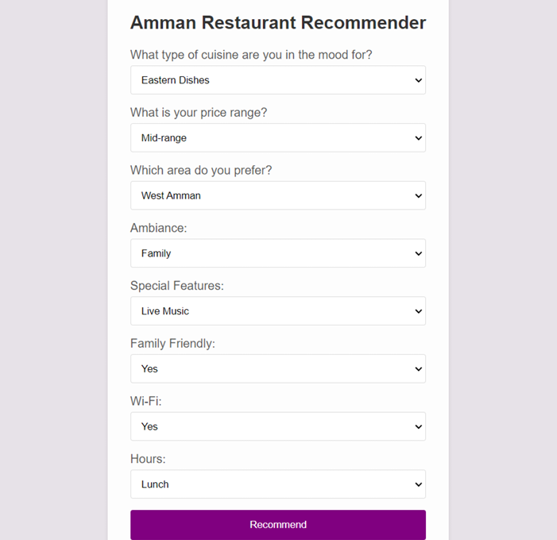
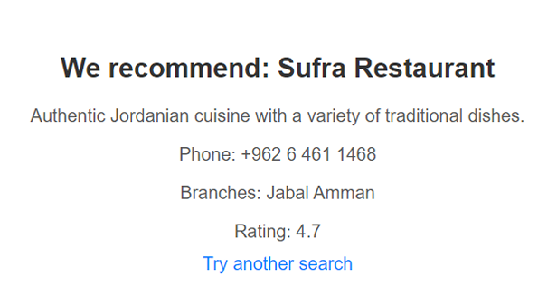

# Restaurant Recommendation Expert System 🍽️

This project is an expert system built with **Python**, **Flask**, and the **Experta** rule-based engine. It helps users receive personalized restaurant recommendations based on their dining preferences, cuisine type, budget, ambiance, and other factors.

## 🔍 Overview

The system uses rule-based logic to recommend restaurants in **Amman, Jordan**. It supports various cuisines like Jordanian, Italian, Seafood, Eastern and Western dishes, Pizza, and more.

Users input their preferences (e.g., desired cuisine, budget, time of day, ambiance), and the system matches them with suitable restaurants using a knowledge engine based on the **Experta** library.

##  Key Features

-  Rule-based logic using `experta.KnowledgeEngine`
-  Supports multiple cuisine types and dining styles
-  Recommendations based on dining time (breakfast, lunch, dinner)
-  Flask web interface for collecting user preferences
-  Outputs restaurant name, description, phone, location, and rating

  ## 📊 Data Source

The restaurant data used in this project for **Amman, Jordan** was collected from the following sources:

- [OpenStreetMap](https://www.openstreetmap.org)  
- [TripAdvisor - Amman Restaurants](https://www.tripadvisor.com/Restaurants-g293986-Amman_Amman_Governorate.html)  
- [Zomato Jordan](https://www.zomato.com/amman)  

The dataset includes restaurant names, cuisine types, locations, phone numbers, user ratings, and descriptions.

## 🏗️ Technologies Used

- **Python 3**
- **Flask** – for the web interface
- **Experta** – for implementing the rule-based engine
- **HTML/CSS (Jinja templates)** – for the frontend
- 

##  Sample Rule Logic

@Rule(CuisineFact(cuisine='Jordanian', price='mid-range', ambiance='family'))
def recommend_jordanian(self):
    self.declare(Fact(recommended_restaurant={
        'name': 'Mansaf Shrrbha Restaurant',
        'description': 'Serves authentic Jordanian Mansaf with Jameed...',
        'phone': '0798730202',
        'branches': 'Seventh Circle...',
        'rating': '4.4'
    }))
    

## 🖼️ System Output

### Input Screen

### Output Screen

##  How to Run

**Run the app**

   python app.py

** Open your browser and navigate to: **
   `http://127.0.0.1:5000`

## ✅ Use Cases

* Travelers looking for authentic food in Amman
* Educational demonstration of rule-based expert systems

